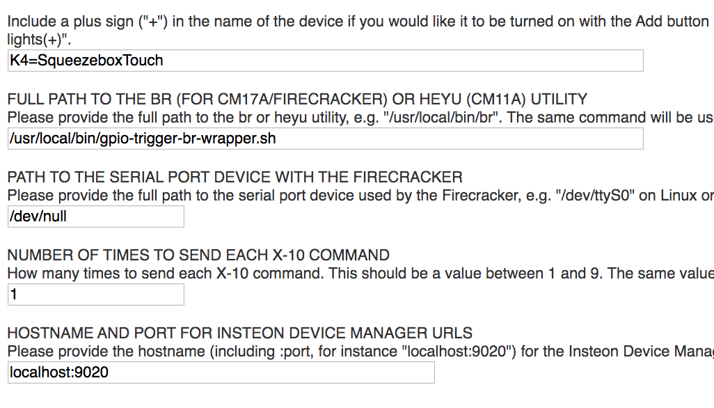

This is a hacky way to use the GPIO pins of a Raspberry Pi to provide an
amplifier trigger from the PowerCenter Squeezebox plugin.

My system looks like this:

* Logitech Media Server 7.9.2 on a Raspberry Pi 4
* Squeezebox Touch
* 2x Hypex UcD400 amplifier modules with the Hypex soft start module

The Hypex soft start module doesn't directly support a 12V trigger input - it
simply has two pins that you wire a power switch across.  I wanted to be able
to close that contact when the Squeezebox Touch player was turned on.

I wired a Velleman VMA406 5V relay module to GPIO pin 14 on the raspi, which is
right next to the +5V and ground pins.  That relay is way overkill, but it's
what I had on hand.  Then I ran a long pair of wires from the normally-closed
relay contacts across my crawlspace to the switch closure inputs on the Hypex
soft start module.

The software part of the solution looks like this:

1. The 3rd-party PowerCenter plugin for LMS is designed to control X10 devices,
   reachable via several ways, including the Bottlerocket "br" utility.
2. A bash script that accepts the "br" utility's arguments, turning them into a
   simple "on" or "off".
3. Another bash script that frobs GPIO pin 14 from sysfs.

To make this work:

1. Install the PowerCenter plugin in LMS.  (This repo contains a mirror of the
   PowerCenter plugin, which has since disappeared from the web.  I make no
   warranty claim on that software.  Who knows what's in there!)  To install,
   unzip the plugin to /var/lib/squeezeboxserver/Plugins.  It should create the
   PowerCenter directory in there.
2. Add the squeezeboxserver user to the gpio group:
   `sudo usermod -a -G gpio squeezeboxserver`
3. Install `gpio-trigger.sh` and `gpio-trigger-br-wrapper.sh` to
   `/usr/local/bin`.  Make them owned by squeezeboxserver and executable.
4. Restart LMS to pick up the new group and the PowerCenter plugin.  `systemctl
   restart logitechmediaserver`.
5. Configure the PowerCenter plugin settings like this, with the
   `/usr/local/bin/gpio-trigger-br-wrapper.sh` script as the `br` binary path:
   

